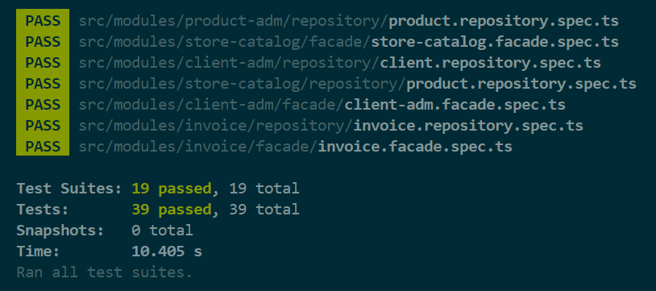

# FC3-Monolitos-InvoiceModule

## Description  
This project is part of a **Monolith System** challenge. The objective is to implement the `Invoice` module, including the `Find` and `Generate` use cases, ensuring a structured and maintainable solution.  

The implementation is written in **TypeScript** and follows **Clean Architecture** principles, ensuring separation of concerns and maintainability.  

Additionally, this repository builds upon a previous repository that implements the **ClientAdm, Payment, ProductAdm, and StoreCatalog** modules. You can find that repository [here](https://github.com/devfullcycle/fc-monolito/tree/main).  

## Challenge Requirements  
To complete this challenge, the following requirements must be met:  

- Implement the `Find` and `Generate` use cases for the `Invoice` module.  
- Define all inputs and outputs strictly following the provided DTOs.  
- Ensure that the module includes the following layers: **Facade, Factory, Domain, Gateway, Repository, and Use Cases**.  
- Write **unit and integration tests** to validate the correctness of the use cases.  
- Ensure that all test cases pass successfully before submission.  
- Maintain a structured codebase following **Clean Architecture** principles.  

## Installation & Setup

###
Cloning the Repository

To get started, clone the repository and navigate to the project directory:
```sh
git clone https://github.com/LuisGaravaso/FC3-Monolitos-InvoiceModule.git
cd FC3-Monolitos-InvoiceModule
```

### Prerequisites
Ensure you have the following installed on your machine:
- [Node.js](https://nodejs.org/en/download) (latest LTS version recommended)
- [npm](https://www.npmjs.com/) (included with Node.js)

### Install Dependencies
Run the following command to install the required dependencies:
```sh
npm install
```
After downloading the packages the folder `node_modules` should appear.

## Running Tests
To execute all unit tests, use the following command:
```sh
npm test
```
All tests should pass as follows.



## Clean Architecture Concepts  
This project follows **Clean Architecture** principles, structured around key concepts:  

### Entity  
Entities are objects with a distinct identity that persist over time. They encapsulate core business rules and behaviors. Examples in this project include:  
- `InvoiceItems`  
- `Invoice`  

### Gateway  
We use the **Gateway Design Pattern** to define an interface for the **Repository**, ensuring a clear contract for persistence operations.  

### Repository  
Repositories provide an abstraction layer between domain objects and the persistence mechanism. They handle operations such as storing, retrieving, and updating domain entities. Example:  
- `InvoiceRepository`  

### Use Case  
Use cases define the application's business logic by orchestrating interactions between entities and repositories. They encapsulate workflows and enforce business rules to ensure consistency and integrity. Examples include:  
- `FindInvoiceUseCase`  
- `GenerateInvoiceUseCase`  

### Facade  
Since we are implementing a **monolithic system**, we use **Facades** to facilitate communication between different modules in a structured and maintainable way.  

### Factory  
This project includes a **Factory Design Pattern** implementation to streamline the creation of the **Facade** and its dependencies.  

## Project Structure
The project follows a structured **Clean Architecture** approach:
```
/src/mod
│── @shared/                 # Shared domain logic, including core business rules
│── client-adm/              # Client Administration module
│── invoice/                 # Invoice module
│   ├── domain/              # Core domain logic, including entities and value objects
│   ├── facade/              # Invoice facade to interact with other modules
│   ├── factory/             # Factory to instantiate use cases and dependencies
│   ├── gateway/             # Interfaces defining repository contracts
│   ├── repository/          # Repository implementation for persistence operations
│   ├── usecase/             # Business logic use cases
│   │     ├── find/          # Implementation of the FindInvoice use case (DTOs and tests)
│   │     ├── generate/      # Implementation of the GenerateInvoice use case (DTOs and tests)
│── payment/                 # Payment module
│── product-adm/             # Product Administration module
│── store-catalog/           # Store Catalog module

```
**NOTE: Only the main folders for this challenge are expanded**

## Database
- This project uses **SQLite** as an in-memory database for testing purposes.
- No additional database setup is required.

Aqui está a versão ajustada da seção de testes no seu README:  

---

## Test Coverage Summary  

This challenge includes a robust set of tests to ensure correctness and maintainability.  

### Unit Tests  
Unit tests focus on testing individual components in isolation, ensuring that each function or class behaves as expected.  
They do not interact with external dependencies like databases or APIs.  

The following unit tests were implemented:  
- `invoice.generate.usecase.spec.ts` – Tests the `GenerateInvoiceUseCase`, ensuring invoices are created correctly.  
- `invoice.find.usecase.spec.ts` – Tests the `FindInvoiceUseCase`, validating retrieval of invoice data.  
- `invoice.repository.spec.ts` – Tests repository methods for persisting and retrieving invoices.  
- `invoice.facade.spec.ts` – Tests the Invoice facade, verifying integration with use cases and repositories.  

### Other Tests  
- Additional tests for related modules and integrations are available in the main repository.  
- More details can be found [here](https://github.com/devfullcycle/fc-monolito/tree/main).